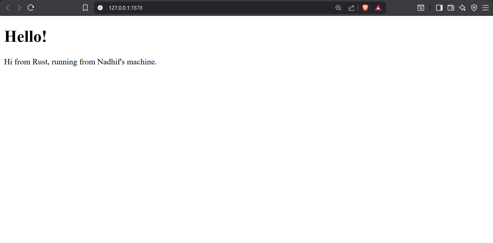
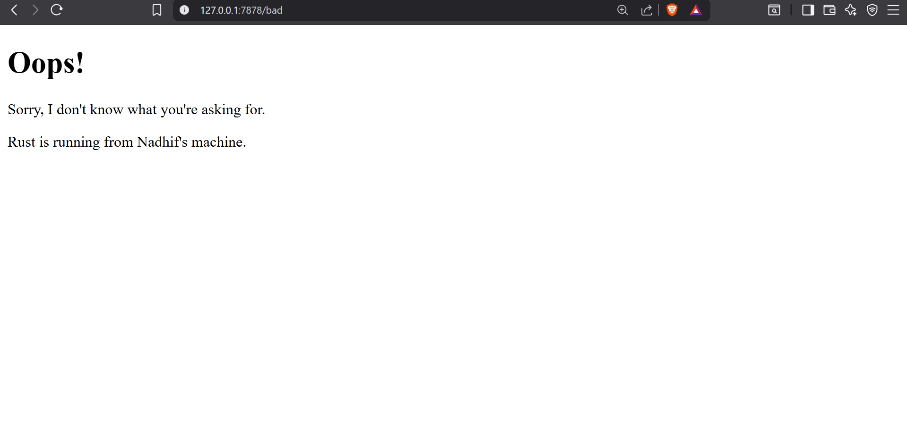

# Reflection
## Commit 1 Reflection Notes
Dalam tahap ini, saya memfokuskan pengerjaan pada fungsi `handle_connection` untuk memproses request HTTP yang masuk melalui TCP. Berikut adalah penjelasan baris per baris mengenai apa yang terjadi di dalam fungsi tersebut berdasarkan dokumentasi Rust:

### Bedah Fungsi `handle_connection`
1. TcpStream (Parameter)
- Fungsi ini menerima parameter `mut stream: TcpStream`. `TcpStream` adalah representasi koneksi antara server dan klien. Statusnya harus mutable (`mut`) karena saat kita membaca data, posisi kursor pembacaan di dalam stream akan berubah/ter-update.

2. `BufReader` (Buffering)
- `let buf_reader = BufReader::new(&mut stream);`
- Berdasarkan dokumentasi Rust, `BufReader` digunakan untuk membungkus tipe I/O agar proses pembacaan lebih efisien. Tanpa ini, sistem akan melakukan system call untuk setiap byte yang dibaca. `BufReader` menyimpan data dalam memori sementara (buffer), sehingga pengambilan data bisa dilakukan sekaligus dalam blok yang lebih besar.

3. `lines()` (Iterator)
- Fungsi ini memecah aliran data (stream) menjadi baris-baris teks dengan mencari karakter newline (`\n`). Ini mempermudah kita untuk memproses protokol berbasis teks seperti HTTP.

4. `map` & `unwrap`
- `.map(|result| result.unwrap())`: Karena pembacaan jaringan bisa saja gagal (misalnya koneksi terputus tiba-tiba), setiap baris yang dihasilkan oleh `lines()` dibungkus dalam `Result`. `unwrap()` digunakan untuk mengambil teks string-nya jika pembacaan berhasil.

5. `take_while` (Kondisi Berhenti)
- `.take_while(|line| !line.is_empty())`: Sesuai spesifikasi protokol HTTP, bagian header permintaan selalu diakhiri dengan baris kosong. Kode ini menginstruksikan server untuk terus membaca selama baris yang diterima tidak kosong. Jika bagian ini terlewat, server akan terus menunggu data baru (hang) dan tidak akan pernah lanjut ke tahap berikutnya.

6. `collect`
- Terakhir, `.collect()` mengumpulkan semua baris teks yang sudah difilter tadi ke dalam sebuah struktur data `Vec<_>` (Vector) agar bisa diproses lebih lanjut atau dicetak untuk keperluan debugging.

## Commit 2 Reflection Notes
Pada commit ini, saya memodifikasi fungsi `handle_connection` agar tidak hanya membaca *request*, tetapi juga memberikan *response* balik ke browser dalam bentuk file HTML. Berikut adalah detail perubahannya:

### Mekanisme Pengiriman Response
* **`fs::read_to_string("hello.html")`**: Fungsi ini digunakan untuk membaca isi file `hello.html` dan mengubahnya menjadi tipe data `String`. File ini harus berada di root direktori proyek agar dapat terbaca oleh program.
* **Format HTTP Response**: Respons yang dikirimkan harus mengikuti standar protokol HTTP. Saya menyusunnya menggunakan makro `format!` dengan struktur:
    - **Status Line**: `HTTP/1.1 200 OK` (Menandakan permintaan berhasil).
    - **Headers**: `Content-Length: {length}` (Memberitahu browser berapa besar data yang dikirim agar browser tahu kapan harus berhenti membaca).
    - **Body**: Isi dari file `hello.html`.
* **`stream.write_all()`**: Fungsi ini mengirimkan seluruh string respons yang telah diformat dalam bentuk byte (`as_bytes()`) ke klien melalui koneksi TCP.

### Bukti Tampilan Browser

## Commit 3 Reflection Notes

Pada Milestone 3 ini, saya melakukan refactoring pada fungsi `handle_connection` agar server dapat memvalidasi request dan memberikan respons yang berbeda tergantung pada path yang diminta oleh klien.

### 1. Mekanisme Pemisahan Respons (Split Response)
Untuk membedakan respons, saya mengambil baris pertama dari HTTP request (`request_line`) yang berisi informasi metode dan path (contoh: `GET / HTTP/1.1`). 
* Jika `request_line` sama dengan `GET / HTTP/1.1`, variabel `status_line` diatur ke `200 OK` dan `filename` ke `hello.html`.
* Jika `request_line` berisi hal lain (misalnya user mengakses `/bad`), variabel `status_line` diatur ke `404 NOT FOUND` dan `filename` ke `404.html`.

### 2. Pentingnya Refactoring
Refactoring dilakukan untuk menerapkan prinsip **DRY (Don't Repeat Yourself)**. Dalam implementasi sebelumnya, jika saya menggunakan blok `if-else` yang besar untuk setiap kondisi, maka kode untuk membaca file (`fs::read_to_string`) dan mengirimkan respons (`stream.write_all`) akan tertulis dua kali. 

Dengan refactoring ini:
* **Efisiensi Kode**: Kode hanya melakukan proses pembacaan file dan pengiriman respons satu kali di bagian akhir fungsi.
* **Maintainability**: Jika di masa depan saya perlu mengubah struktur header HTTP, saya hanya perlu mengubahnya di satu tempat, bukan di setiap cabang `if-else`.
* **Keterbacaan**: Alur logika menjadi lebih bersih karena kita hanya menentukan "apa yang akan dikirim" di awal, lalu "bagaimana cara mengirimnya" dieksekusi secara terpusat di akhir.

### Bukti Tampilan Error 404
